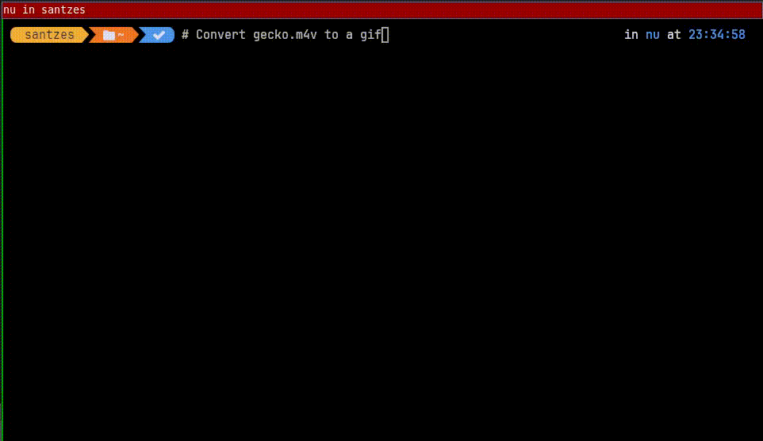

# ChatGPT autocompletion with atuin

Autocomplete using GPT, using data from [atuin](https://github.com/ellie/atuin) command history as input prompt. Uses streaming responses to get the first reply really quickly
The README is put together in minutes, I fill fix it soon.



## Usage
### Nushell
Add this to config.nu:
```
{
    name: complete_with_gtp
    modifier: CONTROL
    keycode: Char_o
    mode: [emacs vi_normal vi_insert]
    event:[
        { send: executehostcommand,
        cmd: "commandline -r (python /path/to/completer.py (commandline) | fzf --track --height 8)"
        }
        { send: Enter }
    ]
}
```

### Fish
To config.fish:

```
function gpt_completion
         commandline (python /home/santzes/storage1_backup/projects/wezterm_gpt/completer.py (commandline) | fzf --track --height 8)
end
bind \ck "gpt_completion"
```

### Other parameters
--atuin: atuin history database location
--dunst: Use dunstify to notify what's happening (debug mostly)
--model: gpt-3.5-turbo or gpt-4. GPT-4 feels much slower for me for this use.
--wezterm: Append screen content from Wezterm

### Terminal content (Wezterm/Kitty)
If you're using [Wezterm](https://github.com/wez/wezterm) you can also add your current terminal screen content to the GPT prompt, which might be useful if there's some error messages that could help generating the correct command line. In that case add -w for the completer.py command line.

Kitty get-text is commented in the code as I couldn't get it working right now, I'll fix it soon or let me know if you find a way.

## Disclaimer
This was posted quite hastily as Atuin hit the HN front page. Code is terrible, there's a bunch of half ready features commented out and I haven't tested it too much. Might require some fixes to work well elsewhere. I'll have a look in the coming days to clean it up.